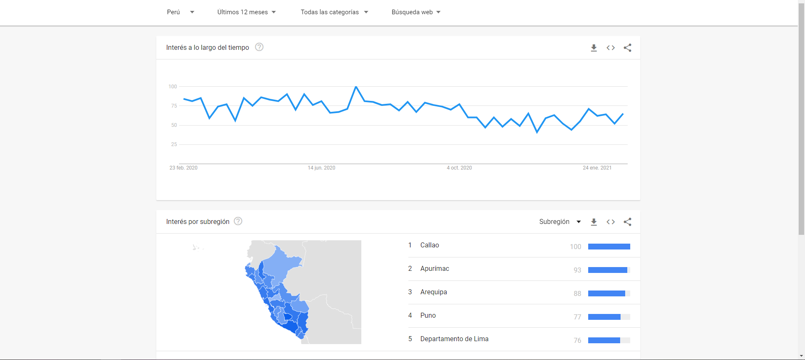

<h2 align="center">  Java ☕ | POO, JDBC, Servlets, JavaEE, Web Services, JSF, EJB, JPA, PrimeFaces, Hibernate, Spring, Struts </h2>


<p align="center">
  
  <a href="https://github.com/BrianMarquez3/Learnig-Java/tags">
    
  </a>
  <a href="https://github.com/BrianMarquez3/Learnig-Java/stargazers">
    
  </a>
  <a href="https://github.com/BrianMarquez3/Learnig-Java/network">
    
  </a>
  <a href="https://github.com/BrianMarquez3/Learnig-Java/network">
    
  </a>
   </a>
   <a href="https://github.com/BrianMarquez3/Learnig-Java/network">
    
  </a>
  
  


## Tabla de contenidos

| Numeration   | Check  |Topic          |
| ------------ |--------|-------------- |
|  001   |✔️ | [Que es java](#Que-es-java)   | 
|  002   |✔️ | [James Gosling](#James-Gosling)   | 
|  003   |✔️ | [Instalacion](#instalacion)  |
|  004   |✔️ | [Hola Mundo](#Hola-Mundo)  |  
|  005   |✔️ | [Variables](#variables)  |  
|  006   |✔️ | [Variables-II](#Variables-II)  |  
|  007   |✔️ | [Constantes](#Constantes)  |  
|  008   |✔️ | [Ingresar Datos Consola](#Ingresar-Datos-Consola)  |  
|  009   |✔️ | [Ingresar Dato ViaShow InputDialog](#Ingresa-Dato-ViaShow-InputDialog)  |  
|  010   |✔️ | [Operadores Matematicos](#Operadores-Matematicos)  |  
|  011   |✔️ | [Operadores Matematicos Cortos](#operadores-Matematicos-Cortos)  |  
|  012   |✔️ | [Operador Incremental Decremental](#Operador-Incremental-Decremental)  |    
|  013   |✔️ | [Operaciones Matematicas Math](#Operaciones-Matematicas-Math)  | 
|  014   |✔️ | [Calcular volumen de un cilindro](#Calcular-volumen-de-un-cilindro)  
|  015   |✔️ | [Manejo de Fechas](#Manejo-de-Fechas)  
|  016   |✔️ | [Condicionales](#Condicionales)  


### Spring
| Numeration   | Check  |Topic          |
| ------------ |--------|-------------- |
|  001  |✔️ | [Introduccion](#Introduccion)   | 

## Ques es Java 

La plataforma Java es el nombre de un entorno o plataforma de computación originaria de Sun Microsystems, capaz de ejecutar aplicaciones desarrolladas usando el lenguaje de programación Java u otros lenguajes que compilen a bytecode y un conjunto de herramientas de desarrollo. En este caso, la plataforma no es un hardware específico o un sistema operativo, sino más bien una máquina virtual encargada de la ejecución de las aplicaciones, y un conjunto de bibliotecas estándar que ofrecen una funcionalidad común. [Wikipedia](https://es.wikipedia.org/wiki/Plataforma_Java)<br>

## James Gosling

<p> James Gosling, OC (19 de mayo de 1955 cerca de Calgary, Alberta, Canadá) es un famoso científico de la computación conocido como el padre del lenguaje de programación Java. </p>


<p> En 1977, Gosling se licenció en ciencias de la computación por la Universidad de Calgary. En 1983, se doctoró por la Universidad Carnegie Mellon, su tesis doctoral se tituló La manipulación algebraica de las limitaciones. Su director de tesis fue Raj Reddy. Mientras trabajaba para su doctorado, escribió una versión de Emacs (Gosling Emacs), y antes de unirse a Sun Microsystems, construyó una versión multi-procesador de Unix, así como varios compiladores y sistemas de correo.</p>

[nighthacks.com](http://nighthacks.com/jag/bio/index.html)<br>

### Incluye

- Plataforma Java, Edición Estándar (Java Platform, Standard Edition), o Java SE (antes J2SE).
- Plataforma Java, Edición Empresa (Java Platform, Enterprise Edition), o Java EE (antes J2EE).
- Plataforma Java, Edición Micro (Java Platform, Micro Edition), o Java ME (antes J2ME).

### Caracteristicas

- Lenguaje java fuertemente tipado
- Lenguaje Orientao a Objeto (POO)
- Esta en todas partes
- Poupular

### Popularidad a Nivel Nacional 2021

  

### Ejemplo

  

### James Gosling
---
## Instalacion

📦 [Instalar JDK](https://www.oracle.com/java/technologies/javase-jdk11-downloads.html) Intalador Oracle JDK Java SE Development ☕
📦 [Instalar Netbeans 12](https://netbeans.org/) Intalador Apache NetBeans


 

---


## Hola Mundo

  | Carpeta                    | Link |     
|----------------------------|:-----------:|
| [Hola Mundo](https://github.com/BrianMarquez3/Learning-Java/tree/main/holaMundo)          |      ✔️     | 

---

## Variables

### Variables
   
```java
    byte - 8 bits
    short - 16 bit
    int - 32 bits
    long - 64 bits
    float  -32 bits
    double  -64 bits
    char - 16 bits
    boolean - 1 bits
```

###  Tipos de Datos Primitivos en Java   

<strong>1. byte</strong>

  Representa un tipo de dato de 8 bits con signo. De tal manera que puede almacenar los valores numéricos de -128 a 127 (ambos inclusive).

<strong2. >short</strong>

  Representa un tipo de dato de 16 bits con signo. De esta manera almacena valores numéricos de -32.768 a 32.767.

<strong>3. int </strong>

  Es un tipo de dato de 32 bits con signo para almacenar valores numéricos. Cuyo valor mínimo es -2^31 y el valor máximo 2^31-1.

<strong>4. float </strong>

  Es un tipo dato para almacenar números en coma flotante con precisión simple de 32 bits.

<strong>5. double </strong>

  Es un tipo de dato para almacenar números en coma flotante con doble precisión de 64 bits.

<strong>6. boolean </strong>

  Sirve para definir tipos de datos booleanos. Es decir, aquellos que tienen un valor de true o false. Ocupa 1 bit de información.

<strong>7. char </strong>
  Es un tipo de datos que representa a un carácter Unicode sencillo de 16 bits.

### Valores por defecto de los tipos de datos primitivos

<table>

  <tr>
    <td>Dato Primitivo</td>
    <td>Valor por Defecto</td>
  </tr>

  <tr>
    <td>byte</td>
    <td>0</td>
  </tr>

   <tr>
    <td>short</td>
    <td>0</td>
  </tr>

  <tr>
    <td>int</td>
    <td>0</td>
  </tr>

   <tr>
    <td>long</td>
    <td>0L</td>
  </tr>

   <tr>
    <td>float</td>
    <td>0.0f</td>
  </tr>

  <tr>
    <td>double</td>
    <td>0.0d</td>
  </tr>

  <tr>
    <td>char</td>
    <td>‘u0000’</td>
  </tr>

  <tr>
    <td>String</td>
    <td>null</td>
  </tr>

   <tr>
    <td>boolean</td>
    <td>false</td>
  </tr>
  

  | Carpeta                    | Link |     
|----------------------------|:-----------:|
| [Variables I Datos Primitivos](https://github.com/BrianMarquez3/Learnig-Java/tree/main/variables)          |      ✔️     | 

---

## Variables-II

  | Carpeta                    | Link |     
|----------------------------|:-----------:|
| [Variables II Datos Envoltorio](https://github.com/BrianMarquez3/Learnig-Java/tree/main/variables_II_Datos_Envoltorio)          |      ✔️     | 

---

## Constantes

  | Carpeta                    | Link |     
|----------------------------|:-----------:|
| [Constantes](https://github.com/BrianMarquez3/Learnig-Java/tree/main/contantes)          |      ✔️     | 

---

## Ingresar Datos Consola

  | Carpeta                    | Link |     
|----------------------------|:-----------:|
| [Ingresar Datos Consola ](https://github.com/BrianMarquez3/Learning-Java/tree/main/IngresarDatosConsola)          |      ✔️     | 

---

## Ingresar Dato ViaShow InputDialog

  | Carpeta                    | Link |     
|----------------------------|:-----------:|
| [Ingresar Dato ViaShow InputDialog ](https://github.com/BrianMarquez3/Learning-Java/tree/main/IngresarDatosViaShowInputDialog)          |      ✔️     | 

---

## Operadores Matematicos

  | Carpeta                    | Link |     
|----------------------------|:-----------:|
| [Operadores Matematicos ](https://github.com/BrianMarquez3/Learning-Java/tree/main/operadoresMatematicos)          |      ✔️     |

---

## Operadores Matematicos Cortos

  | Carpeta                    | Link |     
|----------------------------|:-----------:|
| [Operadores Matematicos Cortos ](https://github.com/BrianMarquez3/Learning-Java/tree/main/operadoresMatematicosCortos)          |      ✔️     |

---

## Operador Incremental Decremental

  | Carpeta                    | Link |     
|----------------------------|:-----------:|
| [Operador Incremental Decremental ](https://github.com/BrianMarquez3/Learning-Java/tree/main/operadorIncrementalDecremental)          |      ✔️     |

---

## Operaciones Matematicas Math

  | Carpeta                    | Link |     
|----------------------------|:-----------:|
| [Operaciones Matematicas Math ](https://github.com/BrianMarquez3/Learning-Java/tree/main/operacionesMatematicasMath)          |      ✔️     |

---

## Calcular volumen de un cilindro

  | Carpeta                    | Link |     
|----------------------------|:-----------:|
| [Calcular volumen de un cilindro ](https://github.com/BrianMarquez3/Learning-Java/tree/main/calcularvolumendeuncilindro)          |      ✔️     |

---

## Manejo de Fechas

  | Carpeta                    | Link |     
|----------------------------|:-----------:|
| [Manejo de fechas ](https://github.com/BrianMarquez3/Learning-Java/tree/main/fechas)          |      ✔️     |

---

## Condicionales

_Ejemplo de Condiciones_

```java
public static void main(String[] args) {
        // condicionales (Sentencia IF, Else)
        Scanner entra= new Scanner(System.in);
        int numUser, numSis;
        numSis = (int) (Math.random()*10);
        System.out.println("Ingresa este numero "+numSis+": ");
        numUser = entra.nextInt();
        
        if(numUser == numSis){
            System.out.println("Coinciden ");
        }else{
            System.out.println("no coinciden ");
        }
    }
```

  | Carpeta                    | Link |     
|----------------------------|:-----------:|
| [Condicionales](https://github.com/BrianMarquez3/Learning-Java/tree/main/condicionales)          |      ✔️     |

---

## Spring

  

  <p> Spring Boot es una de las tecnologías dentro del mundo de Spring de las que más se esta hablando últimamente.¿Qué es y como funciona Spring Boot? . Para entender el concepto primero debemos reflexionar sobre como construimos aplicaciones con Spring Framework . </p>

  - Spring Boot
  - Spring Framework
  - Spring Cloud Data
  - Spring Cloud (Microservicios)
  - Spring Data (DB)
  - Spring Itegration
  - Spring Security
  - Spring Hateoas
  - Spring REST DOCS
  - Spring Mobile

  


## Spotify Music Java
🎵 Music Java [List on Spotify 🎤](https://open.spotify.com/playlist/1UMfu4axebdOMeM996K0xP?si=A-pW9orFSRegxZBWoMZp4w)
>>>>>>> 2336d991cb1003a070c31f109b77b8ce440c1fa4

## Paypal
🩸 Hacer una donación [PAYPAL](https://www.paypal.com/donate?hosted_button_id=98U3T62494H9Y) 🍵
